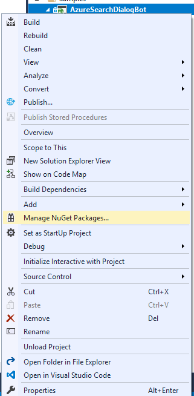
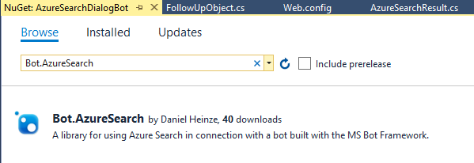
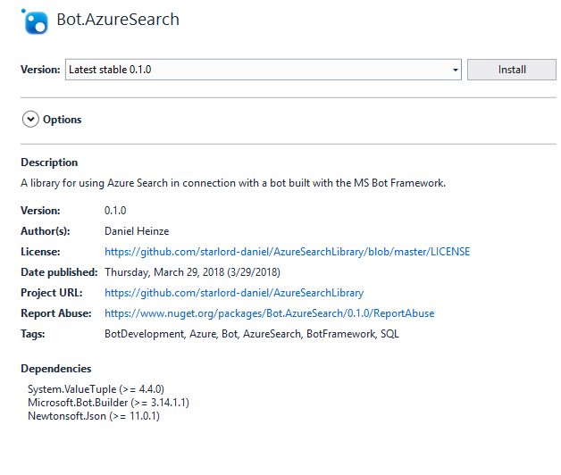
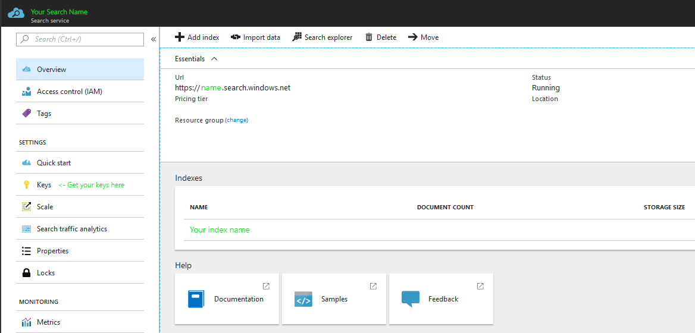

# Azure Search Library
A library for [Azure Search](https://docs.microsoft.com/en-us/azure/search/) that helps you build a bot with it.

You can find the Nuget package here: https://www.nuget.org/packages/Bot.AzureSearch/

# How to use it
Take a look at the samples. They serve 2 use cases: 
1. Simply integrating Azure Search into your bot -> [SimpleAzureSearchBot](https://github.com/starlord-daniel/AzureSearchLibrary/tree/master/SimpleAzureSearchBot)
2. Creating dialogs with Azure Search and a specific database structure [AzureSearchDialogBot](https://github.com/starlord-daniel/AzureSearchLibrary/tree/master/AzureSearchDialogBot)

# Step by step
The library is built for the Bot Builder v3. To get started, take a look at the [official documentation](https://docs.microsoft.com/en-us/azure/bot-service/dotnet/bot-builder-dotnet-quickstart).

## Install the package

If your bot is set up, you can import the library by installing its [Nuget package](https://www.nuget.org/packages/Bot.AzureSearch/). To do this in Visual Studio, go to your project, right click on it and choose: "Manage Nuget packages".



Then search for Bot.AzureSearch in the Browse tab view. 



Install the package by clicking: "Install". This will also download additional packages that the library builds on.



## Use the package for simple searches

To do simple searches in a question-response fashion, you need to create a **SearchApi** object with the credentials of your Azure Search service. You need the Azure Search name, key and index name. These can be found on the [Azure Portal](https://portal.azure.com). 



**Please note:** The search name is the complete  without "https://", not just the custom name. For example: *mysearch.search.windows.net* not just *mysearch*

This is an extract from the RootDialog of the[SimpleAzureSearchBot](https://github.com/starlord-daniel/AzureSearchLibrary/tree/master/SimpleAzureSearchBot) which shows a way of implementing this behaviour: 

```csharp
public class RootDialog : IDialog<object>
{
    public Task StartAsync(IDialogContext context)
    {
        context.Wait(MessageReceivedAsync);

        return Task.CompletedTask;
    }

    private async Task MessageReceivedAsync(IDialogContext context, IAwaitable<object> result)
    {
        var activity = await result as Activity;

        // Declare Azure search object
        SearchApi search = new SearchApi(
            WebConfigurationManager.AppSettings["AzureSearchName"],
            WebConfigurationManager.AppSettings["AzureSearchKey"],
            WebConfigurationManager.AppSettings["AzureSearchIndexName"]
            );

        // Get Azure Search result
        var searchResult = await search.GetAnswerAsync(activity.Text);
        var answers = searchResult.result;

        if (answers == null)
        {
            await context.PostAsync(searchResult.validationResult);
        }
        else
        {
            if (answers.value.Length < 1)
            {
                // tell the user, that we couldn't find an answer
                await context.PostAsync("Unfortunately, I was unable to find an answer for your question. Please try again, by asking another one.");
            }
            else
            {
                // return the first Azure Search answer to the user
                await context.PostAsync(answers.value.First().answer);
            }
        }

        // Close the loop by waiting for an answer and sending it to the MessageReceivedAsync method
        context.Wait(MessageReceivedAsync);
    }
}
```

## Use to package to generate simple dialogs
To generate dialogs, Azure Search is used as an entry point for the interaction with the user. Based on the specific database format, the package will generate prompts for the user that guide him through the conversation.

### Database structure

// Will be updated soon

### Implementation

The RootDialog from the [AzureSearchDialogBot](https://github.com/starlord-daniel/AzureSearchLibrary/tree/master/AzureSearchDialogBot) shows an example on how to implement the afforementioned behaviour:

```csharp
[Serializable]
public class RootDialog : IDialog<object>
{
    public Task StartAsync(IDialogContext context)
    {
        SearchApi searchApi = new SearchApi(
            WebConfigurationManager.AppSettings["AzureSearchName"],
            WebConfigurationManager.AppSettings["AzureSearchKey"],
            WebConfigurationManager.AppSettings["AzureSearchIndexName"]
            );

        SqlConnector sqlApi = new SqlConnector(
            WebConfigurationManager.AppSettings["SqlConnectionString"],
            WebConfigurationManager.AppSettings["SqlTableName"]
            );

        SearchDialog searchDialog = new SearchDialog(
            searchApi: searchApi, 
            sqlConnector: sqlApi, 
            searchThreshold: 0.5f
            );

        // Forward the users input to Azure Search dialog
        context.Wait(searchDialog.StartAzureSearchDialogAsync);

        return Task.CompletedTask;
    }

    private async Task MessageReceivedAsync(IDialogContext context, IAwaitable<object> result)
    {
        var activity = await result as Activity;

        context.Wait(MessageReceivedAsync);
    }
}
``` 
